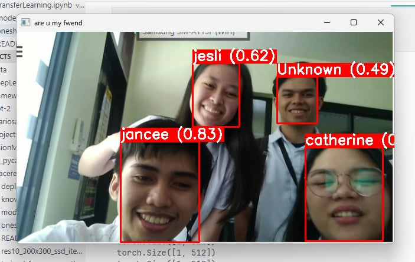
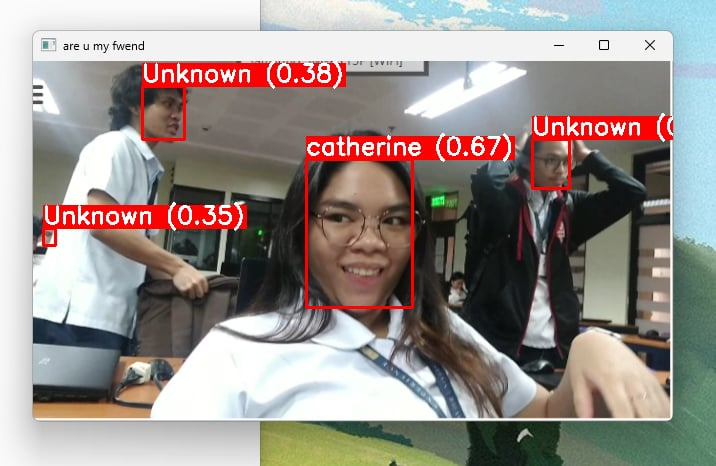
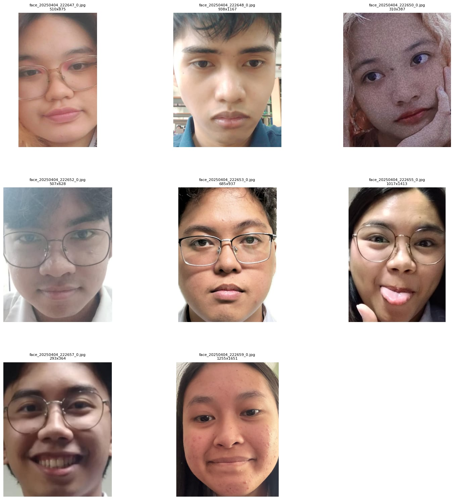

# **One Shot Face Recognition System Using FaceNet & MTCNN**
This project implements a face recognition system using a combination of MTCNN for face detection and FaceNet (InceptionResnetV1) for face embedding.

The system allows users to add known faces, recognize faces in real-time using a camera, and maintain a database of known faces for future identification.


## Multiple Identified One Unknown

&nbsp;
## One Identified and Multiple Unknowns

&nbsp;
## List of Known Face Embeddings



## **Features**
- **Face Detection:** Uses MTCNN to detect faces in images and video frames.

- **Face Recognition:** Uses FaceNet (InceptionResnetV1) to generate face embeddings and compare them using cosine similarity.

- **Real-Time Recognition:** Detects and identifies faces from a live webcam feed.

- **One-Shot Learning:** Allows adding new faces with just one image.

- **Persistent Storage:** Saves and loads known faces using a pickle file.

- **Multi-Person Support:** Allows detection of multiple people in one frame.


# **Directory Structure**
```lua
face-recognition-project/
│ known_faces.pkl
│ yolo11n.pt
│ main.py
│ data/
│   ├── face-recog/
│       ├── oneshot/
│           ├── person1.jpg
│           ├── person2.jpg
│           ├── person3.jpg
│           ├── person4.jpg

```

# **How It Works**

### **1. Loading Known Faces**
- The script loads stored faces from known_faces.pkl (if available).
- If the file does not exist, an empty dictionary is initialized.

### **2. Face Detection** ``(detect_face)``
- Uses MTCNN to detect faces in an image or video frame.
- Extracts detected faces and returns their bounding boxes.

### **3. Face Embedding** ``(get_embedding)``
- Converts an image to a 160×160 RGB format.
- Passes it through FaceNet to obtain a 128-dimensional feature vector.

### **4. Adding New Faces** ``(add_face)``
- Detects a face in the provided image.
- Generates its embedding and normalizes it.
- Stores it in the known_faces dictionary and saves it to a file.

### **5. Face Recognition** ``(recognize_face)``
- Compares a detected face’s embedding with stored embeddings using cosine similarity.
- If similarity > 0.50, it recognizes the person; otherwise, it returns "unknown".

### **6. Live Camera Recognition** ``(start_recognition)``
- Captures frames from the webcam.
- Detects faces and recognizes them in real time.
- Draws bounding boxes and labels on the video feed.

&nbsp;

# **Code Breakdown**
## Model Initialization
```python
device = torch.device('cuda' if torch.cuda.is_available() else 'cpu')
print(f'device used: {device}')

mtcnn = MTCNN(keep_all=True, device=device)
facenet = InceptionResnetV1(pretrained='vggface2').eval().to(device)
```
- Detects available hardware (CUDA or CPU).
- Loads MTCNN for face detection.
- Loads FaceNet for face recognition.

## Loading & Saving Known Faces
```python
def load_known_faces():
    global known_faces
    try:
        with open("known_faces.pkl", "rb") as f:
            known_faces = pickle.load(f)
    except FileNotFoundError:
        known_faces = {}

def save_known_faces():
    with open("known_faces.pkl", "wb") as f:
        pickle.dump(known_faces, f)
```
- Uses **pickle** to store and retrieve face embeddings.
- Ensures persistent face data across multiple runs.


## Detecting & Recognizing faces
```python
def detect_face(image):
    img_rgb = cv2.cvtColor(image, cv2.COLOR_BGR2RGB)
    boxes, _ = mtcnn.detect(img_rgb)
    
    face_list = []
    if boxes is not None:
        for box in boxes:
            x1, y1, x2, y2 = map(int, box)
            face = img_rgb[y1:y2, x1:x2]
            face_list.append(face)
    
    return face_list, boxes
```
- Uses MTCNN to detect faces.
- Extracts face regions from the image.


```python
def recognize_face(face_image):
    face_embedding = get_embedding(face_image)
    
    if not known_faces:
        return "unknown", 0.0

    best_match, best_score = None, -1
    face_embedding = face_embedding / np.linalg.norm(face_embedding)

    for name, stored_embedding in known_faces.items():
        stored_embedding = stored_embedding / np.linalg.norm(stored_embedding)
        similarity = cosine_similarity([face_embedding], [stored_embedding])[0][0]

        if similarity > best_score:
            best_score = similarity
            best_match = name
    
    return (best_match, best_score) if best_score > 0.50 else ("Unknown", best_score)
```
- Normalizes face embeddings.
- Compares them using **cosine similarity**.
- Returns the most similar face if similarity > 0.50.


# Possible Improvements
- **Better Accuracy:** Use a more advanced face recognition model or fine-tune FaceNet.

- **Database Storage:** Replace pickle with an SQL or NoSQL database for better scalability.

- **Multiple Face Storage Per Person:** Store multiple embeddings per person to improve recognition.